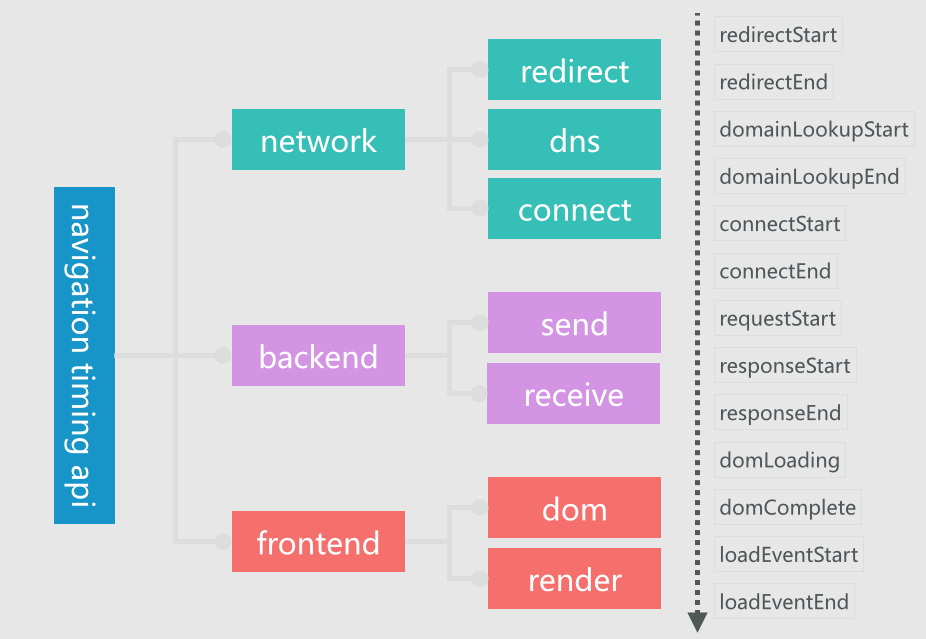

# 性能数据分析指南

> 性能数据的收集依赖Performance Timing API 具体API解释请看[Performance Timing API](http://agroup.baidu.com/iwmfe/md/article/167578)

## setp one 分段分析

- network（指标：`p_net`） : 网络相关总耗时
 
- backend (指标：`p_srv`): 后端服务相关总耗时

- browser (指标：`p_brw）`): 浏览器处理总耗时

> 先通过分析分段总指标来看请求概况，然后追查分段细节指标

## network 网络相关

- `navigationStart` 当前浏览器窗口的前一个网页关闭（ 当一个用户点击一个link，或者在浏览器导航栏输入url链接按下enter以后）时间戳。该时间点是页面统计起点 。
- `redirectStart & redirectEnd` http请求跳转的开始与结束的统计时间戳（2个独立指标，相减表示重定向耗时），如果没有或者不为同域则为0。
- `fetch` 表示HTTP开始请求文档资源的时间戳。
- `domainLookupStart & domainLookupEnd` DNS查找耗时（2个独立指标，相减表示DNS查询耗时）。
- connect：
> `connectStart `表示HTTP发起请求的时间戳。
>  `secureConnectionStart`如果HTTPS，则表示浏览器与服务器开始安全链接的握手时的时间戳。否则0
>  `connectEnd` 表示请求链接成功的时间戳（与connectStart相减表示HTTP发起链接耗时）。

### newwork 统计指标

`p_lookup`: DNS查找耗时

`p_tcp`:  tcp链接耗时

`p_ssl` : SSL握手耗时（HTTPS)

`p_to_connect` ： 建立连接耗时
 
`p_net`: 网络相关总耗时

## backend 后端相关

- `requestStart`  浏览器向服务器发出HTTP请求时的毫秒时间戳  。
- `responseStart`  浏览器从服务器（或从本地缓存读取）收到第一个字节时的时间戳。
- `responseEnd`返回浏览器从服务器（或从本地缓存读取）收到最后一个字节时时间戳。
### backend 统计指标
`p_ttfb`: 首字节响应时间

`p_download`: 接收数据耗时

`p_to_download` : 文档下载总时间（从navigationStart开始计算）

`p_srv`: 后端相关总耗时

## browser 前端相关

- `domLoading`：这是整个过程开始的时间戳，浏览器开始解析 HTML 文档第一批收到的字节 document.
- `domInteractive`：标记浏览器完成解析并且所有 HTML 和 DOM 构建完毕的时间点。
- `domContentLoaded`：标记 DOM 准备就绪并且没有样式表阻碍 JavaScript 执行的时间点 - 意味着我们可以开始构建呈现树了。
  很多 JavaScript 框架等待此事件发生后，才开始执行它们自己的逻辑。因此，浏览器会通过捕获 EventStart 和 EventEnd 时间戳，跟踪执行逻辑所需的时间。
- `domComplete`： 顾名思义，所有的处理完成，网页上所有资源（图片等） 下载完成 - 即加载旋转图标停止旋转。
- `loadEventStart && loadEventEnd`：作为每个网页加载的最后一步，浏览器会触发onLoad事件，以便触发附加的应用逻辑。

### browser 统计指标

`p_dom_ready`: 页面文档渲染完成时间

`p_to_dom_ready`: DOM结构生成时间（包含网络加载等时间）

`p_dom_loaded`: onload事件执行耗时

`p_to_dom_loaded`:  应用可用时间（包含网络加载等时间）

`p_brw`: 前端总耗时

## 指标计算对照表

- `p_net` : `requestStart` - `navigationStart`
- `p_srv` : `responseEnd` - `requestStart`
- `p_brw` : `loadEventEnd -  domLoading`
- `p_lookup`: `domainLookupEnd - domainLookupStart`
- `p_tcp` : `connectEnd - connectStart`
- `p_ssl` : `connectEnd - secureConnectionStart`
- `p_ttfb` : `responseStart - navigationStart`
- `p_download` : `responseEnd - responseStart`
- `p_to_download` : `responseEnd - navigationStart`
- `p_to_connect` : `connectEnd - navigationStart`
- `p_dom_ready`: `domComplete - domLoading`
- `p_to_dom_ready`: `domComplete - navigationStart`
- `p_dom_loaded`: `loadEventEnd - loadEventStart`
- `p_to_dom_loaded`: `loadEventEnd - navigationStart`

## 时间线指标对照

> 该指标的采集为原始相对值（只减去了navigationStart）

- `p_dns` :  `domainLookupEnd`
- `p_ct` :  `connectEnd`
- `p_st` : `responseStart`
- `p_tt` : `responseEnd`
- `p_dct`: `domComplete`
- `p_olt` : `loadEventEnd`